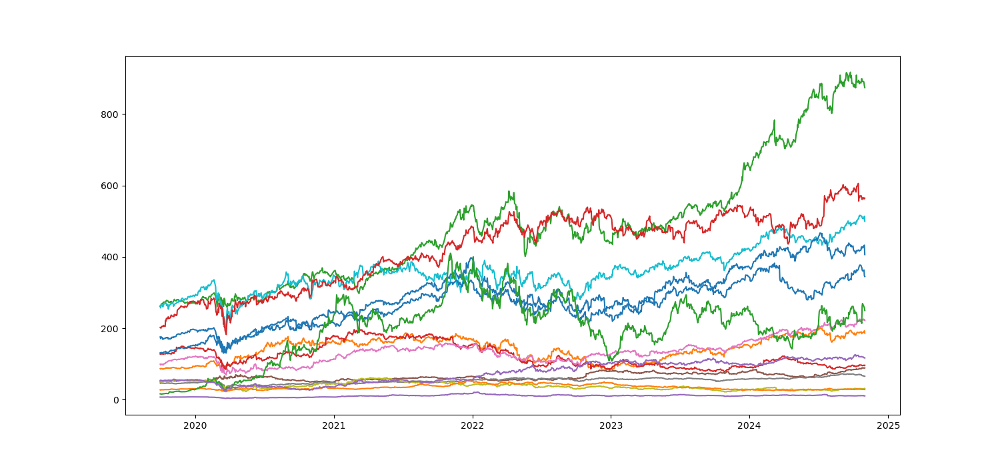

# Portfolio Optimization with Regularized Mean-Variance Model



I implement the Mean-Variance Optimization (MVO) model presented by [H. Markowitz (1952)](https://www.jstor.org/stable/2975974), on the fundamental concept that the optimal portfolio selection strategy is be an optimal trade-off between the return and risk. 

**Decision variables:**

$w = \\{w_1, w_2, ... , w_n \\}$: weight vector for all stocks. 

## The Model

**Parameters:**

$\lambda$: risk aversion. 

$\gamma$: regularization parameter for the L2 norm. 

$\mu$: expected return in percentage of stocks.

$\Sigma$: covariance matrix of all stocks.

**The MVO model:**

$$
\begin{align}
	\text{max}	& (1 - \lambda) \mu - \lambda (w^T \Sigma w) - \gamma \lVert w \rVert ^2 &\\    
	\text{s.t.} 	& \sum w = 1\\
    				& 0 \leq w \leq 1\\
\end{align}
$$

## The Code

The above mathematical model is encoded in Python Jupyter notebook with [CVXPY](https://www.cvxpy.org/) as the solver. Adding the following routine is necessary. 

```javascript

```
 
First, I preprocess the data, i.e., the satellites's locational information from a csv file. 
