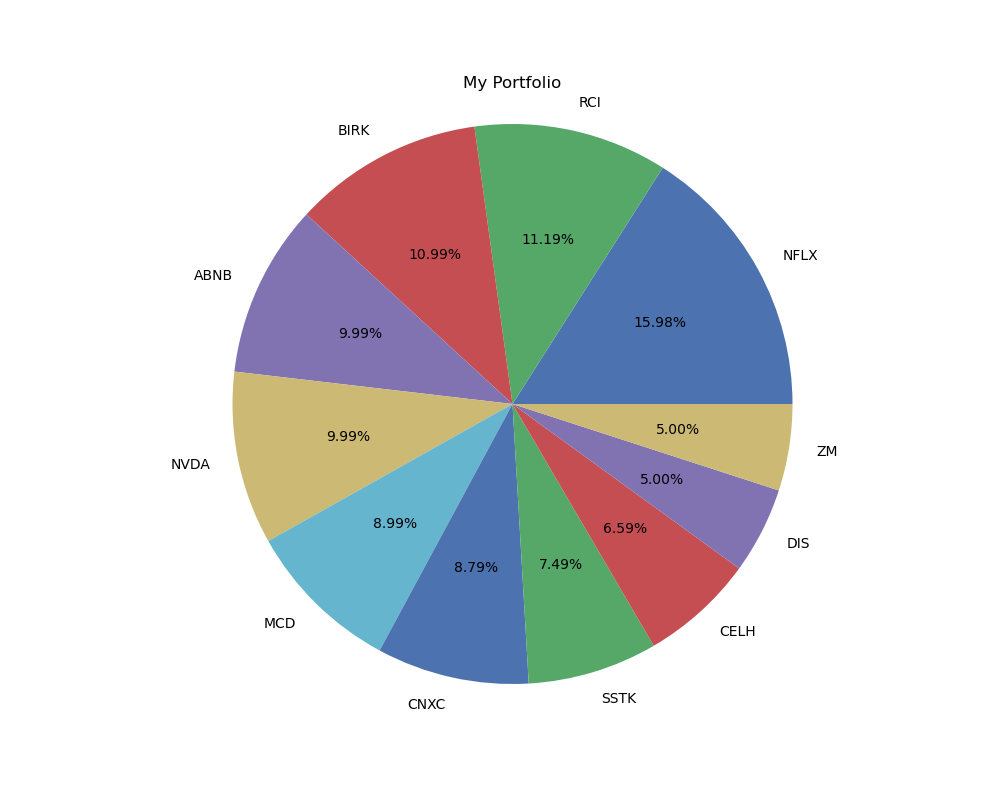

# Portfolio Optimization with Regularized Mean-Variance Model


I implement the Mean-Variance Optimization (MVO) model presented by [H. Markowitz (1952)](https://www.jstor.org/stable/2975974), on the fundamental concept that the optimal portfolio selection strategy is be an optimal trade-off between the return and risk. 

**Decision variables:**

$w = \\{w_1, w_2, ... , w_n \\}$: weight vector for all stocks. 

## The Model

**Parameters:**

$\lambda$: risk aversion. 

$\gamma$: regularization parameter for the L2 norm. 

$\mu$: expected return in percentage of stocks.

$\Sigma$: covariance matrix of all stocks.

**The MVO model:**

$$
\begin{align}
	\text{max}	& (1 - \lambda) \mu - \lambda (w^T \Sigma w) - \gamma \lVert w \rVert ^2 &\\    
	\text{s.t.} 	& \sum w = 1\\
    				& 0 \leq w \leq 1\\
\end{align}
$$

## The Code

The above mathematical model is encoded in Python Jupyter notebook with [CVXPY](https://www.cvxpy.org/) as the solver. Adding the following routine is necessary. 

Import libraries. 

```javascript
import cvxpy as cp
import numpy as np
import pandas as pd
import yfinance as yf
import matplotlib.pyplot as plt
```
Import data. The Excel file "targetPrices.xlsx" should contain at least two columns, 'TICKER' and 'TARGET'. It should be noted that in this project, the target price of a stock is given as an input. Alternatively, the target price can also be calculated at a static fashion using standard models such as [Capital Asset Pricing Model (CAPM)](https://en.wikipedia.org/wiki/Capital_asset_pricing_model). 

```javascript
# The input is stock picks and their target prices from analysts
file_path = 'input_portf/targetPrices.xlsx'
myStocks = pd.read_excel(file_path, sheet_name='Sheet1', index_col='TICKER')[['TARGET']]
myStocks.sort_index(inplace=True)
```
Data-preprocessing. 

```javascript
# Get the stock tickers and target prices
tickers_list = myStocks.index.tolist()
targets = myStocks['TARGET'].to_numpy()

# Get stock prices from Yahoo Finance
data = yf.download(tickers_list, start = '2019-10-1', end = '2024-11-10')['Adj Close'].dropna(how="all")

prices = data.sort_index(axis=1)
print(prices)
```
### Compute the expected prices

```javascript
# Compute expected_returns for later
pv = prices.iloc[-1].to_numpy()
expected_returns = (targets - pv)/pv

# Display Last price, price target, and mu
df_mystocks = pd.DataFrame({
            'TICKER': tickers_list,
            'LAST_PRICE': prices.iloc[-1],
            'TARGET':  myStocks['TARGET'],
            'MU_ANS': expected_returns.tolist()    
})
df_mystocks.set_index('TICKER', inplace = True)

# Display the stocks in the order of the analyst's returns (MU_ANS)
df_mystocks = df_mystocks.sort_values(by='MU_ANS', ascending = False)
df_mystocks.to_csv('input_portf/myPorfolio_returns.csv', index=True)
# df_mystocks.tail(20)
```

### Compute variance-covariance matrix

```javascript
# returns = prices.pct_change()
returns = np.log(prices).diff()
# returns.head()

# Generate var-Cov matrix
cov_matrix_df = returns.cov()
# cov_matrix_df.head()
```
An alternative co-variance matrix (supposedly better)

```javascript
import pypfopt
from pypfopt import risk_models
from pypfopt import plotting

S = risk_models.CovarianceShrinkage(prices).ledoit_wolf()
plotting.plot_covariance(S, plot_correlation=True);
S
```
### Prepare the data format and current holdings for CVXPY

```javascript
# Choose cov_matrix: 
# cov_matrix = cov_matrix_df.to_numpy() # (1)
# cov_matrix = cov_matrix_df    # (2)
cov_matrix = S          # (3)

n = len(expected_returns)

# Stocks that I already owned
# owned = ['ABNB', 'AVGO', 'NFLX', 'NVDA', 'ZM', 'NXT', 'ELF']  
# owned_weights = np.array([0.0807, 0.180, 0.159, 0.177, 0.044, 0.0413, 0.0360])  
owned = ['ABNB', 'BIRK', 'NFLX', 'NVDA', 'ZM', 'DIS', 'MCD']  
owned_weights = np.array([0.1, 0.11, 0.16, 0.1, 0.05, 0.05, 0.09])  
# owned = []
# owned_weights = np.zeros(len(owned))

# Map indices of mystocks within allstocks
owned_indices = [tickers_list.index(j) for j in owned]
remaining_indices = [i for i in range(n) if i not in owned_indices]
```

### Run CVXPY optimization model

```javascript
# Define the optimization variables (weights of the stocks in the portfolio)
weights = cp.Variable(n)

# Define the portfolio expected return (objective is to maximize this)
portfolio_return = expected_returns @ weights

# Define the portfolio variance (risk)
portfolio_variance = cp.quad_form(weights, cov_matrix)

# Risk aversion parameter (adjust based on preference)
lambda_risk_aversion = LAMBDA  # This balances risk vs return. Higher lambda = more risk-averse.
gamma_regularization = GAMMA   # Regularization parameter for L2 norm
max_weight = MAX_WEI             # Maximum allowed weight for any single asset (e.g., 20%)

# Objective: Maximize: (1-lambda) * return - (lambda * risk) - (gamma * L2 norm)
objective = cp.Maximize( (1-lambda_risk_aversion) * portfolio_return - lambda_risk_aversion * portfolio_variance - gamma_regularization * cp.norm(weights, 2)**2)

# Define the constraints: weights must sum to 1 (full investment) and no short selling (weights >= 0)
constraints = [cp.sum(weights) == 1, 
               weights >= 0,
               weights <= max_weight ]

# Fix the weights for owned stocks
for idx, w in zip(owned_indices, owned_weights):
    constraints.append(weights[idx] >= w)
    
# Define and solve the problem (maximize return - risk penalty)
problem = cp.Problem(objective, constraints)
problem.solve(verbose = False)

# Get the optimized weights
optimized_weights = weights.value
# np.round(optimized_weights, decimals=3)
```

## Result

### 1. Optimized Portfolio

```javascript
dict_myport = {'TICKER': tickers_list, 
               'MU_ANS': np.round(expected_returns.tolist() , decimals=3),
               'MAKEUP': np.round(optimized_weights, decimals=3)               
              }
df_myport = pd.DataFrame(dict_myport)
df_myport = df_myport.sort_values(by='MAKEUP', ascending = False)
df_myport[df_myport['MAKEUP'] > 0.02]
```
result

```javascript
	TICKER	MU_ANS	MAKEUP
76	NFLX	0.006	0.160
91	RCI	0.492	0.112
17	BIRK	0.351	0.110
1	ABNB	0.055	0.100
78	NVDA	0.152	0.100
67	MCD	0.044	0.090
30	CNXC	0.490	0.088
95	SSTK	0.514	0.075
23	CELH	0.557	0.066
38	DIS	0.101	0.050
117	ZM	0.019	0.050

```

```javascript
# only show stocks greater than 2%
df_pie = df_myport[df_myport['MAKEUP'] > 0.02]  

# The rest is called "other"
other_makeup = 1 - df_pie['MAKEUP'].sum()
if other_makeup > 0:
    other_row = pd.DataFrame({'TICKER': ['Other'], 'MAKEUP': [other_makeup]})
    df_pie = pd.concat([df_pie, other_row], ignore_index=True)

# Show in a pie chart   
plt.figure(figsize=(10, 8))
plt.pie(df_pie['MAKEUP'], labels = df_pie['TICKER'], autopct = '%0.2f%%')
plt.title('My Portfolio')
plt.axis('equal')  # Equal aspect ratio ensures that pie is drawn as a circle
plt.savefig("output_portf/porfolio_optimal.png")
plt.show()
```




```javascript
```

```javascript
```
```javascript
```
```javascript
```
```javascript
```
```javascript
```
```javascript
```
```javascript
```
```javascript
```
```javascript
```
```javascript
```
```javascript
```
